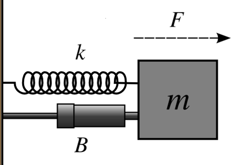

# NN_control_law_Introduction

In this project we are looking to implement a Neural network type control law.
This doesent mean there is something to be learned like in a normal NN problem 
Means the expresion that describes the control signal U is mathematicaly equivalent to a NN

where our controller looks like this

So we have a 2nd degree system (like a mass spring one) and we want to design a complex controller that will
hopefully controll our system in a much better way that a normal PID controller.

Is our job to design a controller that recreate F such that the position of the mass is controlled on a desired value or set point (sp).(this sp is constant for the sake of simplification here)

This output is normally called U instead of F 

Our guess is that the more measurements of the system our controller haves and the more complex is the control law, then the better the controller CAN be if tuned properly.This is what we are tryng to verify here in this project.

Like for instance, a PID controller has 3 'measurements' (error, derivative of error and integral of error) and the way the control law is implemented is by making a linear combination of these 3. Resulting in 3 parameters or gains usually named  Kp, Ki and Kd.

The problem here is that in a normal PID controller  we only need to find 3 values Kp, Ki, Kd to tune our controller. 
Here we have an entire NN to be tuned (find its weights and biases) (thousands of values maybe).

To do that we are going to make use of genetic algorithms .

If you dont know how genetic algorithms work this part is going to be a little hard to understand so i recomend you to seach that before going on. 

So here the the genetic algorithm has to find the hole set of weights and biases of the NN law such that some fitness function J gets minimized 

In this case   𝐽=𝑠𝑢𝑚(〖(𝑥(𝑡)−𝑠𝑝)〗^2)

where x(t) (position of the mass) is the simulation output and sp is the setPoint or desired value for the variable x.
This means that if J is little then the controller is doing its job correctly.

So the genetic algorithm start with some random population of weights and biases, we run the simulation of our NN controller tryng to control our plant, we obtain x(t) and we calculate our fitness function J.

The gentic algorithm uses that fitness function J to make its selection.
It makes its cross over.
Its makes its mutations.
And it repeats the process if not done.

At the end what we found are the weights and biases of the NN_Law that minimize the function J. In other words the parameters of a NN_Law that eficiently controls our plant. 

The code is in the Bodyproject matlab file and the full explanation is in the pptx presentation

 
